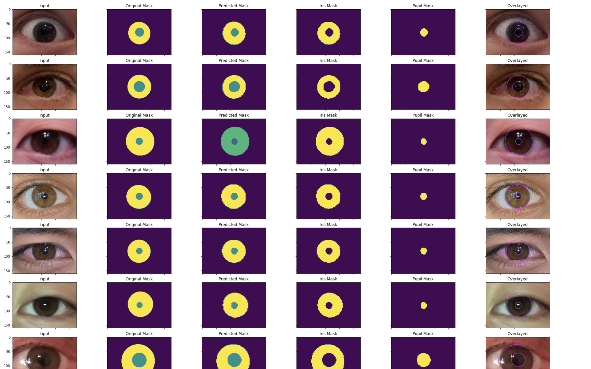
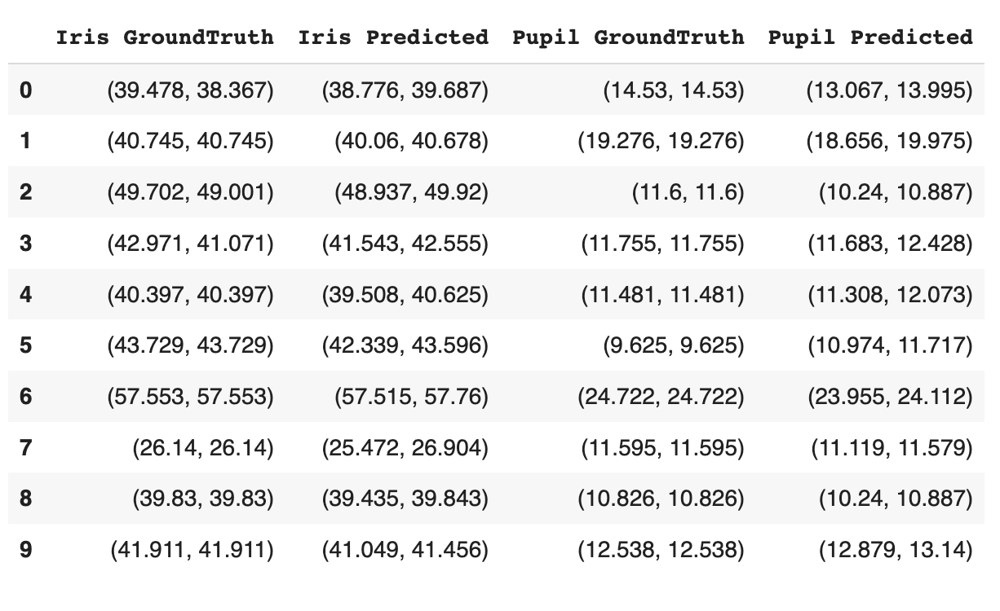
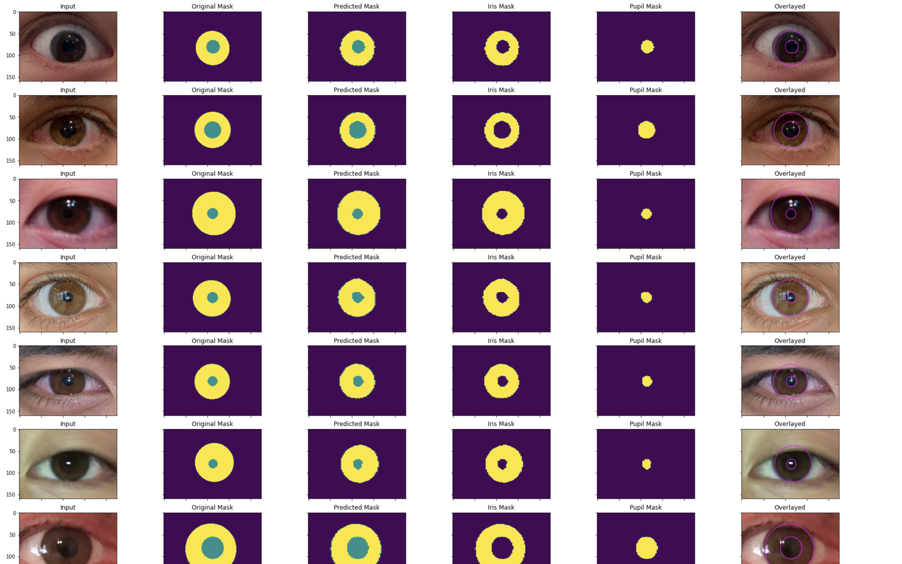
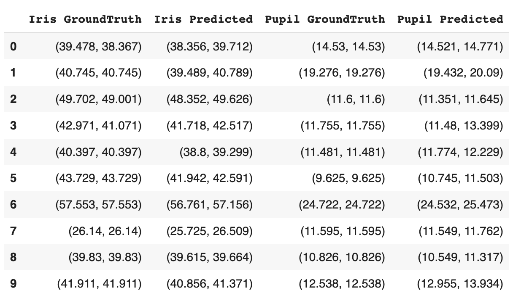

<h1>Pupil_Iris_Net</h1>

This repository presents an end-to-end pipeline for segmenting the pupil and iris from low-resolution eye images and estimating their diameter. The project utilizes two deep learning models, SegNet and UNet for image segmentation tasks.

<h2>Evaluation Metrics</h2>

In this project, we utilize Intersection over Union (IoU) and Mean Absolute Error (MAE) as the primary evaluation metrics. These metrics allow us to quantitatively measure the performance of our segmentation models.

<strong>Intersection over Union</strong>, also known as the Jaccard Index, is a common metric for the quality of a predicted segmentation. It measures the overlap between the predicted segmentation and the ground truth. A high IoU score indicates a highly accurate segmentation.
The IoU score is calculated as follows:
IoU = (Area of Overlap) / (Area of Union)
In the context of our project, we calculate the IoU score for each of the pupil and iris segmentations to evaluate the performance of our models.

<strong>Mean Absolute Percentage Error</strong> is a measure of errors between paired observations expressing the same phenomenon. In our project, we use MAE to quantify the difference between the estimated and true diameters of the pupil and iris.
The MAE is calculated as follows:
MAE = (1/n) * Σ|y - ŷ| * (1/100)
where,
n is the total number of observations
y is the true diameter
ŷ is the estimated diameter
Lower MAE values indicate higher accuracy in diameter estimation.

<h2>1. SegNet</h2>

SegNet is a deep learning architecture designed for semantic pixel-wise segmentation. It has been applied in various contexts, most notably for road scene understanding in autonomous driving. In our project, we repurpose SegNet for segmenting the iris and pupil from eye images.

We used the VGG16 variant of SegNet in our implementation. This model consists of a pre-trained VGG16 encoder network and a corresponding decoder network. The encoder is responsible for capturing the context in the image, while the decoder uses this information to perform a pixel-wise classification, generating a high-resolution output.

The SegNet model in our project was trained to classify each pixel into three classes: background, pupil, and iris. Post-processing techniques, including contour detection and ellipse fitting, were then applied to these segmented images to estimate the diameter of the iris and pupil.

<h3>Ground Truth and Predicted Radii</h3>

<h4>IOU</h4>
<ul>
    <li><strong>Frequency Weighted IOU:</strong> 0.9830833766084841</li>
    <li><strong>Mean IOU:</strong> 0.9423436651750158</li>
    <li><strong>Classwise IOU:</strong>
        <ul>
            <li>Background: 0.99232018</li>
            <li>Pupil: 0.89266451</li>
            <li>Iris: 0.9420463</li>
        </ul>
    </li>
</ul>

<h4>Mean Absolute Percentage Error</h4>
<ul>
    <li><strong>Mean absolute Percentage Error(IRIS)</strong>: 1.1254395814298932</li>
    <li><strong>Mean absolute Percentage Error(PUPIL)</strong>: 2.30140347174629</li>
</ul>

<h2>2. UNet</h2>

UNet represents another prominent architecture frequently employed for image segmentation tasks. Initially, UNet was designed specifically for biomedical image segmentation, where the need for precise localization is paramount. The architecture of UNet is symmetric, encapsulating a contracting path to capture context and a symmetric expanding path that ensures precise localization. This combination makes UNet particularly effective in tasks that require both context understanding and fine-grained localization.

In the context of our project, we have repurposed UNet to perform segmentation of the iris and pupil. The model is trained to classify each pixel of the image into one of the three classes, similar to our approach with SegNet. The classes encompass the background, pupil, and iris.

Following the segmentation process, the same post-processing techniques used with SegNet, such as contour detection and ellipse fitting, are applied. These techniques facilitate the estimation of the diameters of the iris and pupil from the segmented images.

The results obtained from the UNet model, including the quality of segmentation and the accuracy of diameter estimation, are evaluated using the same metrics, Intersection over Union (IoU) and Mean Absolute Error (MAE). This allows for a direct and fair comparison between the performances of the SegNet and UNet models in our specific task.

Below you can find the visual representation of the results obtained using UNet model:

<h3>Ground Truth and Predicted Radii</h3>

<h2>Results</h2>

|        **Metrics**           | **SegNet**   | **UNet**     |
|-------------------|----------|----------|
| **Frequency Weighted IOU** | 0.9831   | 0.9825103130422714      |
| **Mean IOU**          | 0.9423   | 0.9480763160905994      |
| **Classwise IOU (Background)** | 0.9923   | 0.99156482      |
| **Classwise IOU (Pupil)** | 0.8926   | 0.91304348      |
| **Classwise IOU (Iris)** | 0.9420   | 0.93962065      |
| **Mean Absolute Percentage Error (Iris)** | 1.1254   | 0.21060213388753685      |
| **Mean Absolute Percentage Error (Pupil)** | 2.3014   | 1.0051745357400579      |

<h2>Analysis</h2>
The following analysis is based on the results obtained from the SegNet and UNet models:

    <strong>1. Frequency Weighted IOU:</strong> This metric shows that both SegNet and UNet have a high overlap with the ground truth, indicating accurate segmentation. UNet, with an IoU of 0.9825, is slightly lower than SegNet, which achieved an IoU of 0.9831. However, the difference is negligible, suggesting that both models perform exceptionally well in terms of frequency weighted IoU.

    <strong>2. Mean IOU:</strong> UNet outperforms SegNet in the Mean IoU, achieving a score of 0.9481 compared to SegNet's 0.9423. This indicates that, on average, UNet provides a more accurate segmentation across all classes.

    <strong>3. Classwise IOU:</strong> In the case of classwise IoU, UNet outperforms SegNet for the 'Pupil' class with a score of 0.9130 compared to SegNet's 0.8926. However, SegNet has a slightly higher score for the 'Background' and 'Iris' classes. This suggests that while UNet might be more accurate for pupil segmentation, SegNet could be more suitable for background and iris segmentation.

    <strong>4. Mean Absolute Percentage Error (MAPE):</strong> UNet significantly outperforms SegNet in terms of MAPE for both 'Iris' and 'Pupil' classes. This indicates that UNet estimates the diameters of the iris and pupil with higher accuracy compared to SegNet.

